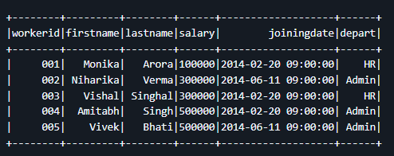
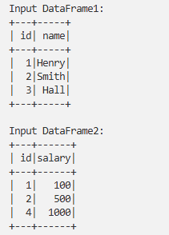
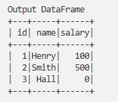
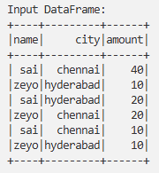
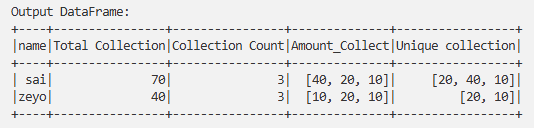
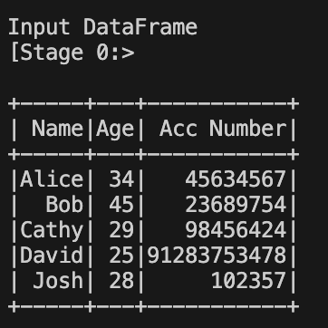
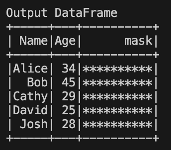

# PySpark-SQL-Training-Scenarios
This repository contains a collection of practical **PySpark and Spark SQL training scenarios** designed for learning, practice, and reference.

## PySpark-SQL Training Scenarios

## Table of Contents

| No | Scenario |
|----|---------|
| 1  | [Scenario1](#scenario1) |
| 2  | [Scenario2](#scenario2) |
| 3  | [Scenario3](#scenario3) |
| 4  | [Scenario4](#scenario4) |
| 5  | [Scenario5](#scenario5) |
| 6  | [Scenario6](#scenario6) |
| 7  | [Scenario7](#scenario7) |
| 8  | [Scenario8](#scenario8) |
| 9  | [Scenario9](#scenario9) |
| 10 | [Scenario10](#scenario10) |

---

## Scenario1 

**Query:** *Get employees with equal salary*

**Input DataFrame:**

**Expected Output:**

**Solution Links:**

- **PySpark:** [Scenario1.py](PyFiles/Scenario1.py)

[⬆ Back to Top](#pyspark-sql-training-scenarios)

---

## Scenario2

**Query:** *Join with handling nulls*

**Input DataFrame:**

**Expected Output:**

**Solution Links:**

- **PySpark:** [Scenario2.py](PyFiles/Scenario2.py)

[⬆ Back to Top](#pyspark-sql-training-scenarios)

---

## Scenario3

**Query:** *(Add query description here)*

**Input DataFrame:**

**Expected Output:**

**Solution Links:**

- **PySpark:** [Scenario3.py](PyFiles/Scenario3.py)

[⬆ Back to Top](#pyspark-sql-training-scenarios)

---

## Scenario4

**Query:** *(Add query description here)*

**Input DataFrame:**

**Expected Output:**

**Solution Links:**

- **PySpark:** [Scenario4.py](PyFiles/Scenario4.py)

[⬆ Back to Top](#pyspark-sql-training-scenarios)

---

## Scenario5

**Query:** *(Add query description here)*

**Input DataFrame:**

**Expected Output:**

**Solution Links:**

- **PySpark:** [Scenario5.py](PyFiles/Scenario5.py)

[⬆ Back to Top](#pyspark-sql-training-scenarios)
